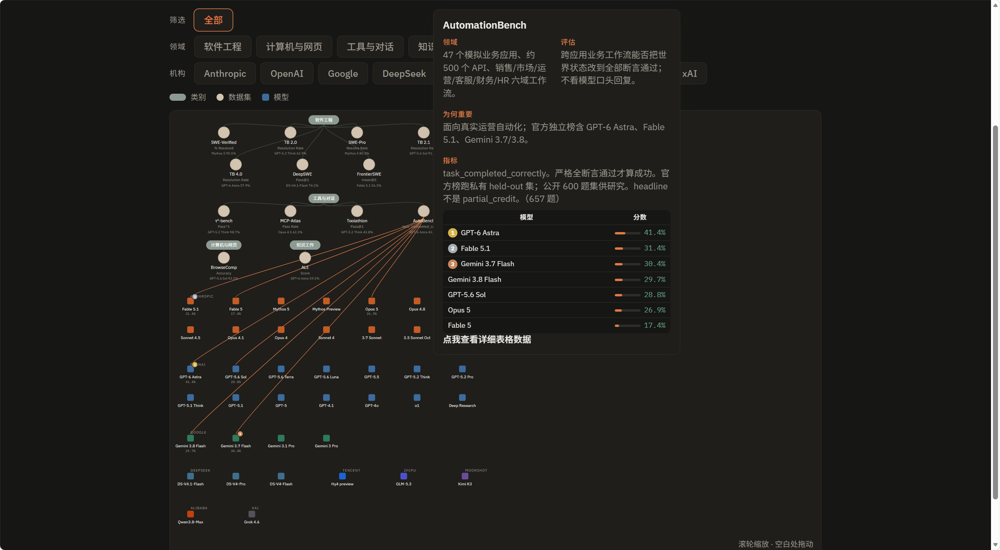
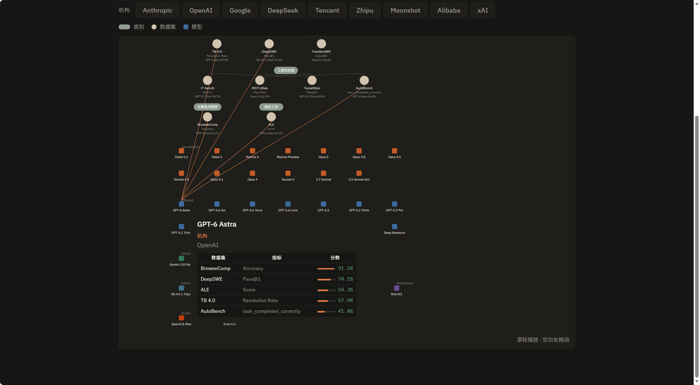
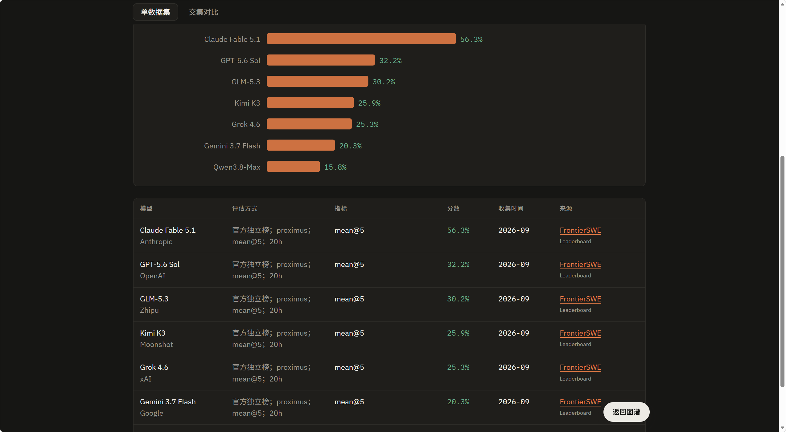
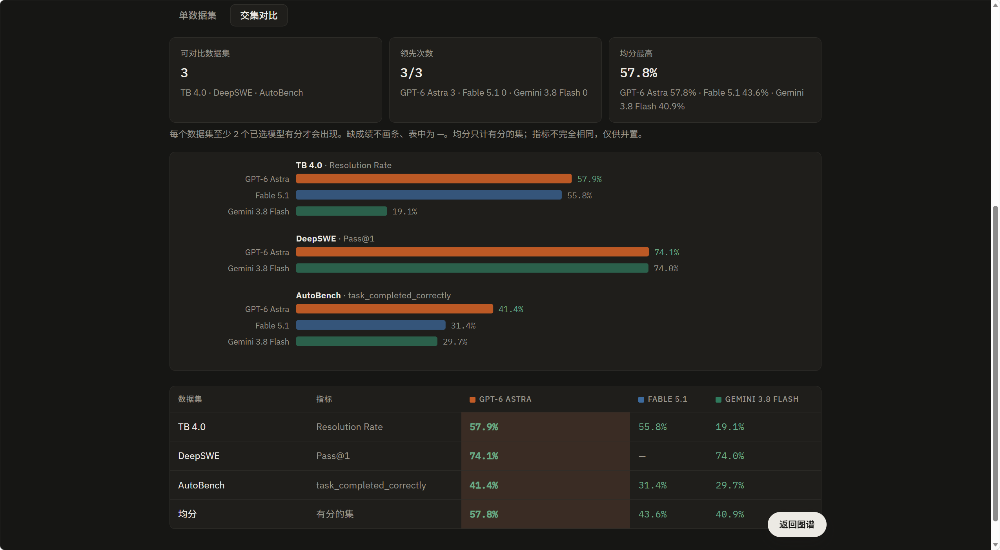

# Benchmark Atlas

静态站，用来并置查看 **Agent / Harness 评测**：同一张图里看领域、数据集和模型，再下钻到分数表。

在线：https://unbsky.github.io/Benchmark-Visualization-/

本地：

```bash
python -m http.server 8765
```

打开 `http://127.0.0.1:8765/`。

## 用法

**图谱**

- 绿胶囊 = 领域，橙圆点 = 数据集，方块 = 模型。
- 上方可按领域 / 机构筛选；点模型只看相关数据集。
- 默认不画数据集–模型连线；悬停或选中节点才显示。
- 滚轮缩放，空白处拖动。点数据集进入图表。

图谱显示数据集信息（悬停数据集看各模型分数与前三名）：



图谱显示模型信息（悬停模型看它在各数据集上的成绩）：



**图表**

- **单数据集**：下拉换领域和数据集，看条形图与来源表。

详细表格和来源信息：



- **交集对比**：选至少 2 个模型。某数据集只要在其中 ≥2 个模型上有分，就会进入对比；缺成绩显示为 —。可再去掉部分数据集。点表中数据集名回到单集详情。

交集对比表格：



- 图表页右下角「返回图谱」随时回到图谱。

## 数据从哪来

成绩写在 `data/benchmarks.js`，每条都链到原始出处。大致几类：

- **论文 / arXiv**：SWE-bench、Terminal-Bench、τ²-bench、SWE-Bench Pro、MCP-Atlas、Toolathlon、DeepSWE、Agents' Last Exam 等。
- **官方榜与站点**：SWE-bench Leaderboards、Terminal-Bench、Scale Labs、Zapier AutomationBench 等。
- **厂商系统卡与发布文**：Anthropic、OpenAI、Google、DeepSeek、智谱、Moonshot、通义、腾讯 Hy、xAI 等。

当前收录的数据集包括：SWE-bench Verified、SWE-Bench Pro、Terminal-Bench 2.0 / 2.1 / 4.0、τ²-bench、BrowseComp、MCP-Atlas、Toolathlon、DeepSWE v1.1、Agents' Last Exam、FrontierSWE V2、AutomationBench。

加新数据只改 `data/benchmarks.js`，说明见 [如何加入数据集.md](如何加入数据集.md)。
